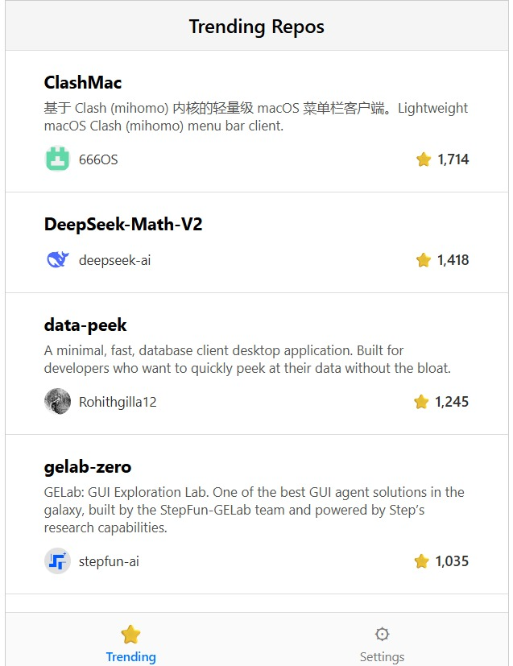

# GitHub Trending Repositories -- React App

A clean and responsive React application that displays **the most
starred GitHub repositories created in the last 10 days**.\
This project demonstrates API integration, infinite scrolling, reusable
components, and mobile-style UI.

## 🚀 Features

- Fetch trending GitHub repositories using GitHub Search API\
- Infinite scroll\
- Sticky header\
- Mobile navigation bottom tabs\
- Responsive and clean UI\
- Displays:
  - Repository name\
  - Description\
  - Stars count\
  - Owner username + avatar

## 📁 Project Structure

    src/
    ├── App.jsx
    ├── App.css
    └──services/
    |  ├── githubService.js
    └── components/
        ├── RepoList.jsx
        ├── RepoItem.jsx
        └── RepoItem.css

## 📦 Installation

```sh
git clone https://github.com/saqlainraza14/github-starred-repos.git
cd github-starred-repos
npm install
```

## ▶️ Run the project

```sh
npm start
```

Your app will run at:

    http://localhost:3000

## 🏗️ Build for production

```sh
npm run build
```

## 📷 Final Output Preview

Below is a sample output similar to the final UI (mobile-style layout):

!(

## 🛠 Tech Stack

- React 18+
- JSX Components
- GitHub REST API
- Modern CSS & Flexbox
- Create React App (CRA)

## 🙌 Author

**Saqlain Raza**\
GitHub: https://github.com/saqlainraza14
